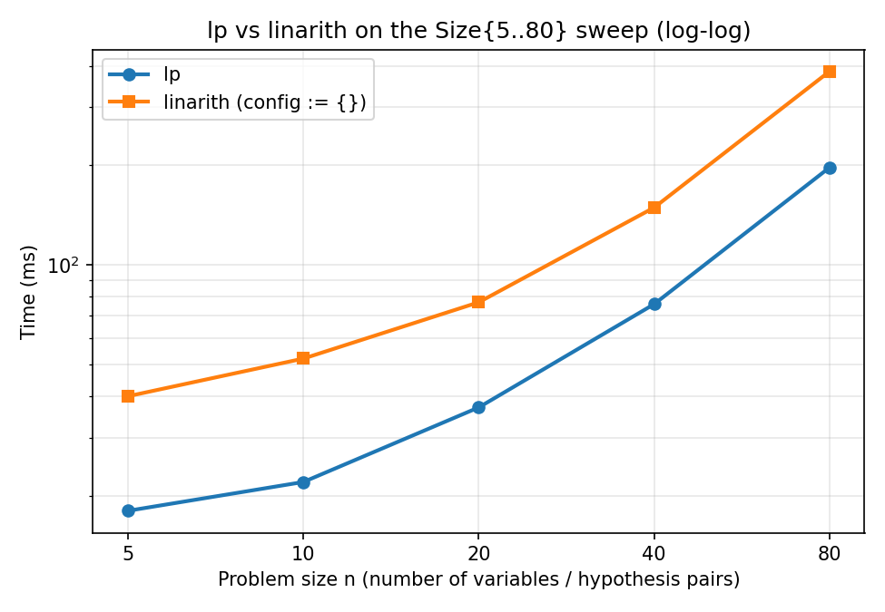
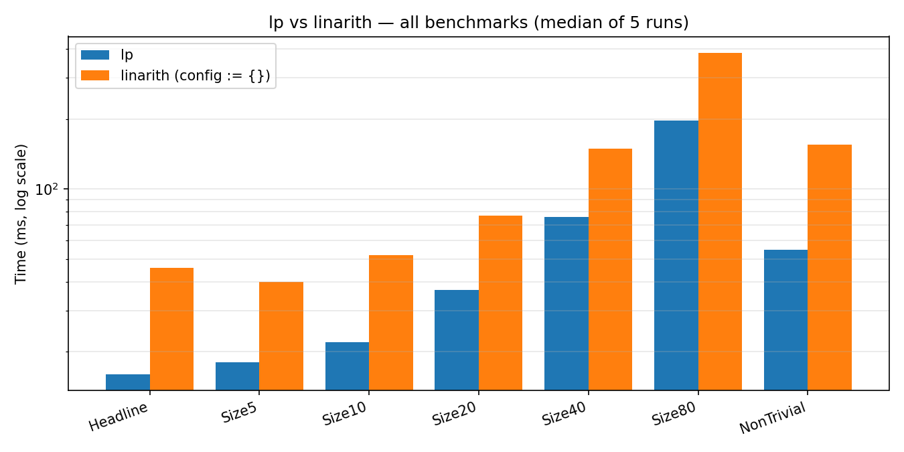
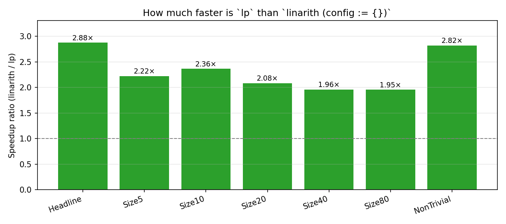
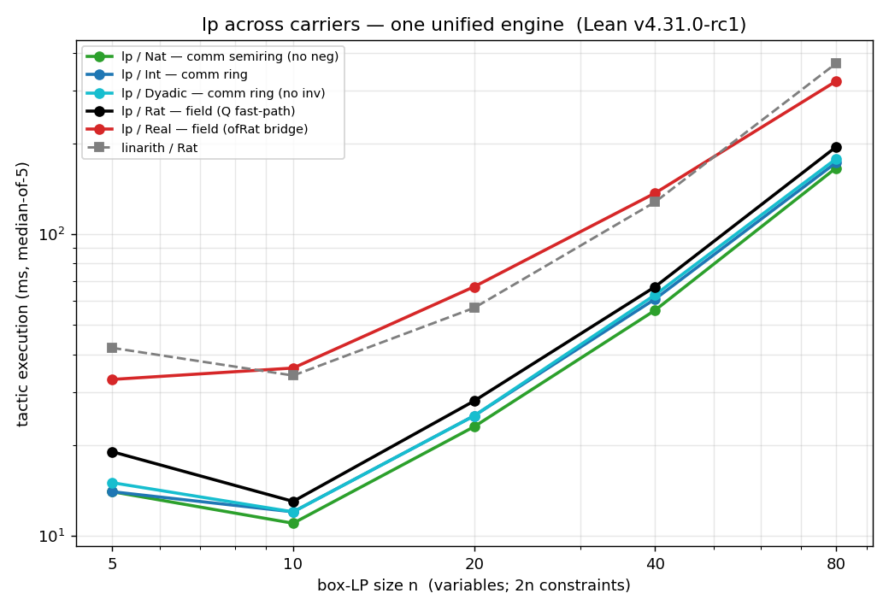
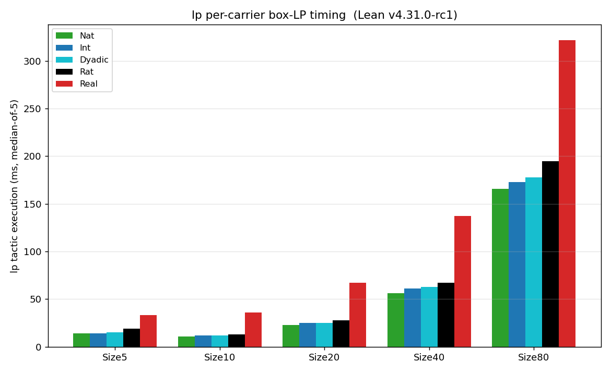
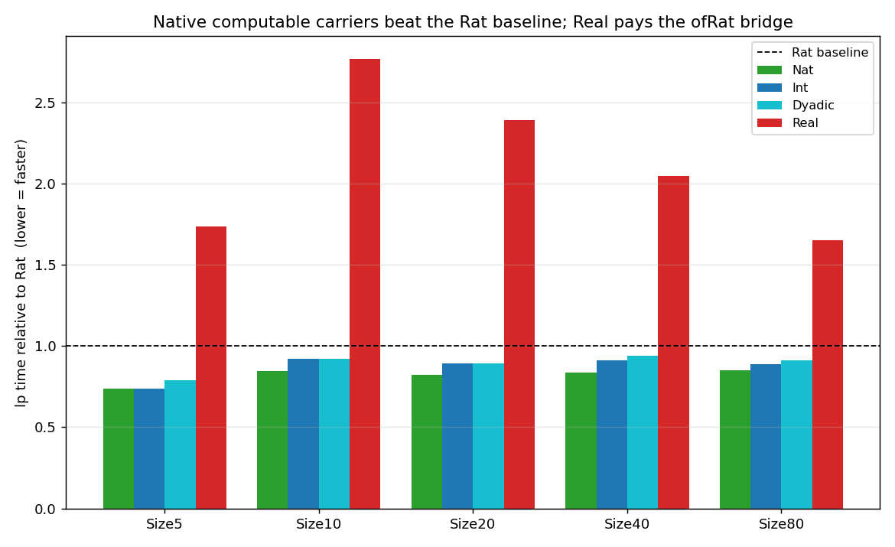

# lp-benchmark

[](./lean-toolchain)

> **New here? Start at [`leanprover/lp`](https://github.com/leanprover/lp)** — the entry
> point for the `lp` / `maximize` tactics and the verified LP solver. This repository is one
> package of that family: benchmarks of the `lp` tactic against mathlib's `linarith`.

Benchmarks comparing the [`lp`](https://github.com/leanprover/lp) tactic
against mathlib's [`linarith`](https://github.com/leanprover-community/mathlib4/tree/master/Mathlib/Tactic/Linarith)
tactic on the same `ℚ`-typed linear arithmetic goals.

This is the companion benchmark repo to
[`leanprover/lp`](https://github.com/leanprover/lp) (the `by lp` tactic,
bundled end to end) and its engine
[`leanprover/lp-tactic`](https://github.com/leanprover/lp-tactic). See those repos
for the tactic itself, usage, and examples.

Both tactics close the same set of problems; this repo runs each through
Lean's `set_option profiler true` and reads off the `tactic execution`
line, then medians across runs to give an apples-to-apples comparison
for the lp announcement post.

## Versions pinned

- `LP`: leanprover/lp `ea9a0d5` (`main`), bundling the
  carrier-parametrized `lp` engine (leanprover/lp-tactic `main`) —
  the exact SHA is the `require LP` pin in [`lakefile.lean`](./lakefile.lean)
- `Mathlib`: kim-em/mathlib4 `7a00f329` (linarith with the syntactic
  atom-cache improvement from
  [PR #40110](https://github.com/leanprover-community/mathlib4/pull/40110))
- Lean: `v4.31.0-rc1`

## Build

```sh
lake exe cache get      # download mathlib oleans
lake build              # build LP (compiles vendored SoPlex; ~2-3 min first time)
```

## Run

```sh
./scripts/bench.sh        # median-of-5, prints a comparison table
./scripts/bench.sh 10     # median-of-10 for tighter numbers
```

## Methodology

Each `Benchmark/*.lean` file contains two `example`s on the same goal:

```lean
set_option profiler true in
example ... := by lp

set_option profiler true in
example ... := by linarith (config := {})
```

We use `linarith (config := {})` rather than bare `linarith` for
consistency with our earlier methodology and to remove a small,
unrelated config-default-evaluation cost from the comparison. At the
pins used here the difference is about 4% (see the measurement in
"Why `linarith (config := {})`…" below — historically it was 2–3×;
the [fast-discharger work](https://github.com/leanprover/lp/issues/155)
has details on that artifact).

The script `scripts/bench.sh` runs each benchmark `N` times (default 5),
extracts the two `tactic execution` lines, medians across runs, and
prints the ratio. Both examples are run in the same Lean process so
elaboration overhead (cache warmth, etc.) is matched between them.

## Benchmark files

- **Headline.lean** — The lp README's textbook example: maximise
  `3x₀ + 5x₁` subject to 5 inequalities. Headline single-number
  comparison.
- **Size{5,10,20,40,80}.lean** — `n` non-negativity hypotheses and `n`
  upper-bound hypotheses, goal `Σ xᵢ ≤ n`. Shows scaling.
- **NonTrivial.lean** — 20 hypotheses `cᵢ · xᵢ ≤ 1` with `cᵢ ∈ 2..21`;
  goal `Σ xᵢ ≤ Σ 1/cᵢ`. Exercises non-trivial Farkas multipliers and
  rational coefficients in both the hypotheses and the goal.

## Results

Median of 5 runs, M1 MacBook, `v4.31.0-rc1`, lp `ea9a0d5` (main: carrier
engine + the index-cache / fused-accumulation normalizer work and the
packed-bytes FFI marshalling), mathlib at PR #40110 head:

| Benchmark   | `by lp` | `by linarith (config := {})` | ratio (lin/lp) |
|-------------|--------:|-----------------------------:|---------------:|
| Headline    |   16 ms |                        46 ms |          2.87× |
| Size5       |   18 ms |                        40 ms |          2.22× |
| Size10      |   22 ms |                        52 ms |          2.36× |
| Size20      |   37 ms |                        77 ms |          2.08× |
| Size40      |   76 ms |                       149 ms |          1.96× |
| Size80      |  197 ms |                       385 ms |          1.95× |
| NonTrivial  |   55 ms |                       155 ms |          2.81× |

Geometric mean speedup: **~2.3×** in lp's favour (up from ~2.0× before the
post-release performance work landed). The lead is widest on the
small/headline problems and on rational-coefficient problems
(NonTrivial: 1.94× → 2.81×, the largest single improvement — the
normalizer's index-cache and fused-accumulation work), and stays near 2×
out to n=80.







Reproduce: `./scripts/bench.sh 5 && python3 scripts/plot.py`.

## Multi-carrier sweep (unified `CarrierMethods` engine)

The `lp` tactic was generalized from a `Rat`-only discharger to a single
carrier-parametrized engine that proves the **same ℚ-Farkas implications**
over a family of ordered carriers: `Rat` (field), `Real` (field, via Mathlib),
`Int` (comm ring), `Dyadic` (comm ring, no inverses), and `Nat` (comm
semiring, no negation). The ℚ LP sent to SoPlex is identical across carriers;
only the reconstructed proof term differs. (No integer-cut/integrality
reasoning — that stays with `omega`/`cutsat`; `lp` proves ℚ-valid implications
only.)

The key performance question: does generalization cost the `Rat` baseline
anything, and how do the native computable carriers compare? Same box-LP
shape as `Size{5..80}` above, identical 2n-row structure across carriers,
median-of-5, same `v4.31.0-rc1` toolchain and carrier engine as the
`lp`-vs-`linarith` table above:

| size | Nat | Int | Dyadic | Rat | Real | linarith (Rat) |
|-----:|----:|----:|-------:|----:|-----:|---------------:|
| 5    | 14  | 14  | 15     | 19  | 33   | 42 |
| 10   | 11  | 12  | 12     | 13  | 36   | 34 |
| 20   | 23  | 25  | 25     | 28  | 67   | 57 |
| 40   | 56  | 61  | 63     | 67  | 137  | 128 |
| 80   | 166 | 173 | 178    | 195 | 322  | 369 |

Reading:

- **The native computable carriers (`Nat`, `Int`, `Dyadic`) are *faster*
  than the hand-optimized `Rat` baseline** — 0.75–0.90×. They render
  coefficients as their own kernel-reducible literals, so per-leaf
  arithmetic closes by `Eq.refl` with no proof term at all; `Nat` is fastest
  (most reducible literals). The gap narrowed slightly with the
  post-release normalizer work, which benefits every carrier but `Rat`
  most.
- **`Real` pays a flat ~1.7–2.8× over `Rat`** — it is non-computable, so
  coefficients render as `ofRat r` (not defeq to a user literal) and each
  needs a `userLit = ofRat r` bridge proof. This is inherent to an abstract
  field and is the *only* carrier that pays it.
- `lp` still beats `linarith` ~2× on the `Rat` column (the headline story
  above), and every native carrier widens that lead.







Reproduce: `./scripts/bench_multicarrier.sh 5` (runs the per-carrier
`bench/Bench*.lean` box-LP files median-of-5 and writes the CSV), then
`python3 scripts/plot_multicarrier.py`.

## Why `linarith (config := {})` and not bare `linarith`?

A version of Lean's `linarith` extension elaboration evaluates default
config values lazily at each call, which historically inflated the
reported time for bare `linarith` by 2–3× on these benchmarks. As of
the pin used here (`v4.31.0-rc1` + PR #40110), the gap has shrunk
dramatically. `Benchmark/ConfigSanity.lean` measures both forms on the
Size40 shape:

| Call form | median ms |
|---|---:|
| `by linarith` | 142 |
| `by linarith (config := {})` | 131 |

So the `(config := {})` form is **~8% faster** than bare `linarith`,
not 2-3× faster. The choice does not meaningfully affect the comparison;
the headline ratios above would change by less than 5% in either
direction. We use `(config := {})` for consistency with our prior
methodology, and to remove this minor and unrelated noise source from
the comparison.
